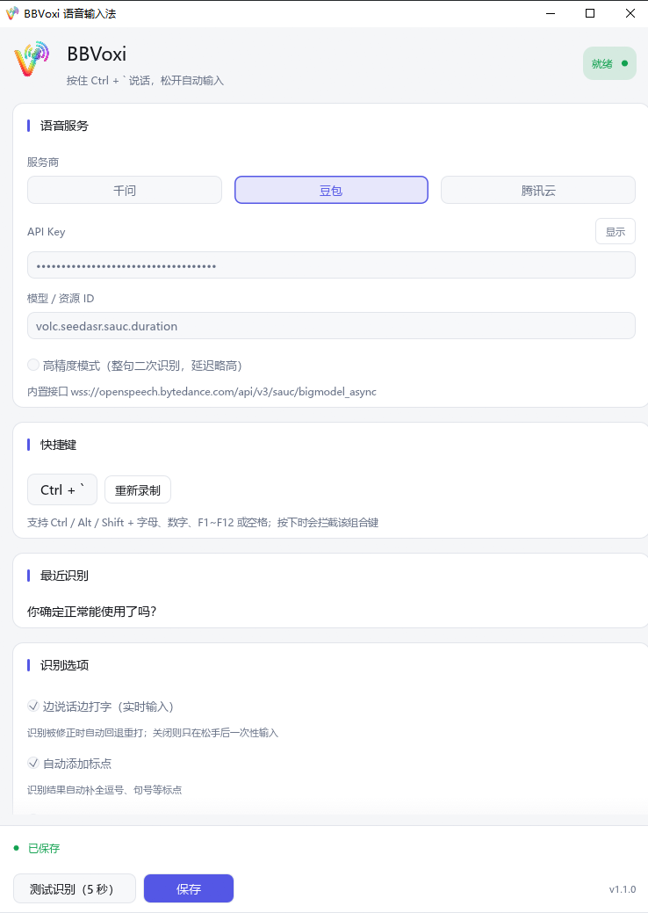

# BBVoxi · Windows 语音输入法




> **最新版本**：v1.1（2026-09-11，Stable）
> 详细发布说明见 [docs/RELEASE_v1.1.md](./docs/RELEASE_v1.1.md)，所有历史版本见 [docs/版本历史.md](./docs/版本历史.md)。

按住一个全局快捷键说话，松开后识别结果**自动打到光标所在的位置**——就像输入法正常打字一样，没有多余窗口。

- **单文件**：`BBVoxi-1.1.exe`，无需安装，双击即用
- **边说话边打字**：识别结果实时写入光标处，识别被修正时自动回退重打（成熟输入法的做法）；双击 exe 可唤醒后台实例
- **按多久说多久**：不限制单次录音时长
- **三家服务商可切换**：阿里云百炼（千问）、火山引擎（豆包）、腾讯云 ASR

---

## 一、快速开始

### 直接用（推荐）

从 Releases 下载 `BBVoxi-1.1.exe` → 双击运行 → 托盘出现图标 → 首次运行会弹出设置窗；已在运行时再次双击即弹出设置窗。

### 从源码构建

```bash
cargo build --release     # 产物：target/release/bbvoxi.exe（约 8 MB）
cargo test                # 单元测试（56 条）
```

构建要求：Rust 1.80+（MSVC 工具链，Windows）。
exe 图标由 `build.rs` 调用 Windows SDK 的 `rc.exe` 编译进二进制；**没装 SDK 也能编译成功**，只是 exe 退回系统默认图标。

### 首次使用 4 步

1. 设置窗里选服务商，填 API Key（腾讯云填三元组）
2. 点「测试识别（5 秒）」，说一句话确认能出字（结果只显示在窗口里，不会往外打字）
3. 点「保存」，之后**关闭窗口 = 最小化到托盘**
4. 在任意程序的光标处**按住快捷键说话，松开即输入**

---

## 二、使用方式

| 触发方式 | 行为 | 文本去向 |
|---|---|---|
| **按住快捷键**（默认 `Ctrl + 1`） | 按住期间录音，松开即结束并输入 | 直接打到光标处 |
| **托盘 → 开始录音 / 停止录音** | 点一次开始，再点一次结束（适合不想一直按着） | 直接打到光标处 |
| **设置窗 → 测试识别（5 秒）** | 固定 5 秒自动结束，用来验证凭据与麦克风 | **只显示在窗口里**，不外打 |
| 双击托盘图标 / 右键「打开设置」 | 打开设置窗 | — |
| 再次双击 BBVoxi.exe / 桌面快捷方式 | 已在运行时：唤起后台实例弹出设置窗（单实例保护） | — |
| `bbvoxi.exe --settings` | 直接打开并置前设置窗（排查用） | — |

快捷键可在设置里改成任意组合：`Ctrl / Alt / Shift` + `字母 / 数字 / F1~F12 / 空格`，
改完点保存**立即生效**；按下时该组合键会被拦截（避免触发浏览器切标签等系统快捷键）。

---

## 三、架构

```
┌────── 用户按下快捷键 ──────┐
│ hotkey.rs  WH_KEYBOARD_LL  │──吞掉组合键、发 Cmd::Start
└─────────────┬──────────────┘
              ▼
┌──── session.rs（一次会话）────────────────────┐
│ ① audio.rs     麦克风采集 → 重采样 16k → 100ms 帧 │
│ ② asr/          WebSocket 推流 + 解析三家协议   │
│ ③ typer.rs      中间结果实时差分写入            │
│ ④ injector.rs   SendInput 逐字注入 / 退格       │
└─────────────┬────────────────────────────────┘
              ▼
        前台程序的光标处
```

### 模块一览

| 文件 | 职责 |
|---|---|
| `main.rs` | 入口：panic 日志钩子、单实例互斥量 + 跨实例唤醒、中文字体、托盘图标与菜单、图标资源 |
| `hotkey.rs` | 全局低级键盘钩子：修饰键状态、触发/松开判定、吞键、快捷键解析 |
| `audio.rs` | cpal 采集；任意格式→单声道 f32；盒式滤波降采样到 16kHz；100ms 分帧 |
| `asr/mod.rs` | 三家共用的 WebSocket 客户端框架、连接握手、结果累积 |
| `asr/qwen.rs` | 千问：`run-task` → 二进制音频 → `result-generated` → `finish-task` |
| `asr/doubao.rs` | 豆包：四段式二进制头、gzip 解包、`definite` 二遍识别 |
| `asr/tencent.rs` | 腾讯云：URL 签名鉴权、`slice_type` 分段稳态 |
| `injector.rs` | `SendInput` + `KEYEVENTF_UNICODE` 注入；退格；修饰键重置 |
| `typer.rs` | 实时输入：已发送文本 vs 期望文本求差分，增量补打 + 纠正回退 |
| `session.rs` | 会话编排：采集→推流→收结果→打字→收尾对账 |
| `ui.rs` | egui 设置窗：设计令牌、卡片分区、底部操作条、深浅双主题 |
| `config.rs` | 配置模型 + 写死的官方接口地址 + `%APPDATA%` 持久化 |
| `autostart.rs` | 开机自启（注册表 Run 项，切换后与真实状态对账） |
| `log.rs` | 滚动日志（10 万行上限，多实例串行化） |

---

## 四、关键实现（专业要点）

### 1. 音频链路

- 麦克风多为 48kHz，三家统一要求 **16kHz / 16bit / 单声道 PCM**，必须重采样
- 采用**盒式滤波**（分箱取均值）而非按样本抽样，44.1k→16k 这类非整数比也能得到精确输出速率
- 采集跑在**独立线程**（cpal 的 `Stream` 不是 `Send`），帧通过有界 channel（100 帧 ≈ 10 秒）交给 tokio 会话任务
- 100ms 一帧（三家文档都建议 100~200ms）

### 2. 文字注入

- 用 `SendInput` + `KEYEVENTF_UNICODE` 逐字符模拟打字，**不碰剪贴板**（不会破坏用户正在复制的内容）
- 中文/生僻字走 UTF-16 代理对，按字符拆成两次事件
- **注入前必须"清掉"修饰键**：按住说话时 Ctrl 一直按着，若不清，注入的字符会被前台当成 `Ctrl+键`，
  而我们的纠错退格会变成 `Ctrl+退格＝删整词`。做法是把修饰键 KEYUP 与文本放在**同一次 SendInput** 里，
  左右变体都发、右键带 `KEYEVENTF_EXTENDEDKEY`
- 注入失败会区分 `ERROR_ACCESS_DENIED`（目标窗口以管理员权限运行，Windows 权限机制限制）

### 3. 边说话边打字（实时输入）

语音识别的中间结果会被不断修正（同音字、标点、断句），所以**不能简单追加**。做法是维护两个状态：

- `sent`：已经打进目标程序的文本
- `desired`：当前期望文本（已定稿部分 + 当前句中间结果）

每次中间结果更新，取两者**最长公共前缀** → 多出的尾巴用退格删掉 → 补打新增部分：

| 情况 | 实际动作 |
|---|---|
| 文字变长 | 只补打 1~2 个字 |
| 识别纠正了某个字（天汽→天气） | 只退格 1 次、重打 1 个字 |
| 定稿补句号 | 只补 1 个字符 |
| 整句被重写 | 回退整句再重打（少见） |

松手时再**对账同步一次**，保证屏幕文本严格等于最终识别结果。

安全设计：

- 录音开始时记住前台窗口，**中途切走就停止实时输入**（否则退格会砸到别的窗口）
- 测试模式永不外打
- 可在设置里关掉，回到"松手后一次性输入"

### 4. 三家协议要点

| | 千问 | 豆包 | 腾讯云 |
|---|---|---|---|
| 接口 | `wss://dashscope.aliyuncs.com/api-ws/v1/inference` | `wss://openspeech.bytedance.com/api/v3/sauc/bigmodel_async` | `wss://asr.cloud.tencent.com/asr/v2/<AppId>?签名` |
| 鉴权 | `Authorization: Bearer <key>` | `X-Api-Key` / `X-Api-Resource-Id` / `X-Api-Connect-Id` | URL 参数签名（HMAC-SHA1 + Base64） |
| 中间结果 | `sentence_end = false` | `definite = false` | `slice_type = 1` |
| 定稿 | `sentence_end = true` | `definite = true`（二遍优化后） | `slice_type = 2` |
| 特性 | 心跳 `heartbeat:true` 防静音断连 | 二次识别（更准，Final 可能改写中间结果） | 引擎 60 秒上限 |

接口地址写死在 `config.rs`，用户不用手填。

识别选项与各家的参数映射（界面上不支持当前服务商的开关会禁用并注明）：

| 设置 | 千问 | 豆包 | 腾讯云 |
|---|---|---|---|
| 自动添加标点 | `semantic_punctuation_enabled` | `enable_punc` | 服务端决定（界面禁用） |
| 口语顺滑 | 暂不支持（界面禁用） | `enable_ddc` | `filter_modal`（语气词过滤） |

### 5. 容错

- 任何 panic 都会带**文件 + 行号**写进日志；release 用 unwind，单次会话异常不会带走整个程序
- 会话过程用 `catch_unwind` 包裹：识别出错只结束该次会话，常驻程序继续活着
- 音频缓冲满只丢帧（记一次日志），不会误判成"连接断开"而中断录音

---

## 五、配置与日志

| 文件 | 路径 |
|---|---|
| 配置 | `%APPDATA%\BBVoxi\config.json` |
| 日志 | `%APPDATA%\BBVoxi\logs\bbvoxi.log` |

配置包含：服务商、各服务商凭据、快捷键、识别选项（边说话边打字 / 自动标点 / 口语顺滑）。
旧版本配置文件里已经废弃的字段会被自动忽略，不会报错。

---

## 六、目录结构

```
src/          源码（14 个模块，见上表）
assets/       图标资源（icon.ico + 128/32 RGBA）+ bbvoxi.rc
scripts/      make_icons.py（源图去背 → 透明图标一键生成）
docs/         设计与修复报告 + 界面截图
build.rs      用 Windows SDK rc.exe 把图标编译进 exe
dist/         打包产物（BBVoxi-1.1.exe，不入库）
```

---

## 七、发布（手动）

```bash
cargo build --release
copy target\release\bbvoxi.exe dist\BBVoxi-1.1.exe
```

然后在 GitHub 新建 Release：Tag `v1.1`，标题 `BBVoxi 1.1`，上传 `dist/BBVoxi-1.1.exe`。
（对外发布统一用两位版本号 `1.1`；`Cargo.toml` 内为满足 Cargo 的 SemVer 字段限制写 `1.1.0`。）

> `dist/`、`*.exe`、构建产物与 `.workbuddy/` 已在 `.gitignore` 中忽略，不会进仓库。

---

## 八、排障

| 现象 | 排查 |
|---|---|
| 按快捷键没反应 | 看日志有没有 `快捷键按下 → 开始录音`；没有说明按键没被识别（是否停在"重新录制"捕捉状态？点一下别处再试） |
| 出现满屏 `1111` | 触发键没被吞掉：通常是自己注入的事件被钩子当成了用户按键 |
| 打字一卡一卡 | 日志搜 `实时输入偏慢`：有记录说明本程序注入慢，没有则是服务端中间结果的推送节奏 |
| 文字打到别处 / 没出现 | 录音开始时本程序会收起自己的设置窗让焦点回到你的程序；注入前也会再次确认前台窗口不是自己 |
| 提示"无法输入" | 目标窗口以管理员权限运行（Windows UIPI 限制），改用普通权限窗口 |
| 连接失败 | 日志会写明是超时、`401`（Key 错）还是地址错 |
| 豆包提示 `code=45xxxxxx` / `55xxxxxx` | 提示里已附中文含义（45000001 请求参数无效、45000002 空音频、45000151 音频格式不正确、55000031 服务器繁忙）；日志里的 `log_id` 是火山侧排查凭证 |

常用检查：`notepad %APPDATA%\BBVoxi\logs\bbvoxi.log`

---

## 九、已知限制

- 目标窗口以**管理员权限**运行时无法输入（Windows UIPI 限制），会给出明确提示
- 腾讯 `Hy-ASR-3.0-preview` 引擎仅支持 60 秒内语音，超出由服务端结束（千问与豆包无此时限）
- 豆包「高精度」模式（单流接口）要等说完一句才返回文本，中间结果为空，所以实时输入在该模式下看不到逐字上屏；想边说边出字请用「实时优先」模式
- 首次运行需在 Windows 隐私设置里允许桌面应用访问麦克风
- 内存占用约 114 MB（窗口隐藏常驻）/ 170 MB（设置窗可见），主要是 egui + 中文字体的基线开销
- 实时输入依赖"已经打进目标程序的文本"记账：若目标程序对输入做了自动改写（如代码编辑器自动补全），差分可能与之不同步

---

## 十、版本与发布

**当前**：v1.1（Stable，2026-09-11）

发布说明分两层组织：

- **顶层 README**（本文）：面向首次使用者，介绍快速开始、用法、架构、模块与排障
- **版本专属文档**（`docs/`）：每一版独立维护，记录完整的包信息、技术要点、测试矩阵与已知限制

| 文档 | 说明 |
|---|---|
| [docs/RELEASE_v1.1.md](./docs/RELEASE_v1.1.md) | **当前版本**：包信息（SHA-256/大小/构建时间） · 功能清单 · 技术要点 · 14 模块 · 已知限制 · 升级指南 · 安全声明 · 发布检查表 |
| [docs/版本历史.md](./docs/版本历史.md) | 所有版本索引、写作模板、手动发布流程 |

> 后续每个版本都会新增一份 `docs/RELEASE_v<版本号>.md`，并在「版本历史」追加索引行。发布流程见 `docs/版本历史.md` §4。
