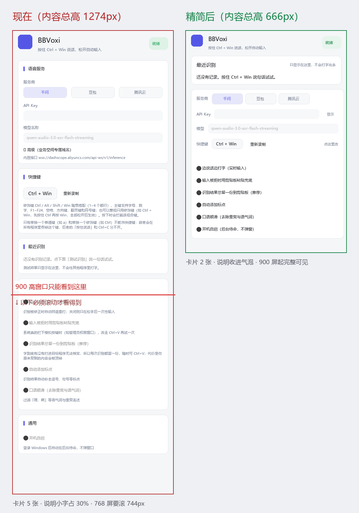

# BBVoxi 界面与代码审查报告（UI/UX 重点）

> **落地状态**：本报告的建议已在 **1.3.3** 实施完毕（方案 C 重排 + 全部配套修复 + 两批共 7 条功能硬伤）。
> 实施结果与实测复核见 [RELEASE_v1.3.3.md](./RELEASE_v1.3.3.md)；改版前后对比图见 `docs/_ui_compare_real.png`。
> 下面保留的是**当时的诊断原文**（含源码行号），行号对应 1.3.2，仅作追溯用。

> 范围：v1.3.2（commit 1389365）源码 + 全部 156 条单测（`cargo test` 全绿，4 条 ignored）
> 方式：纯静态审查 + 无界面布局实测（egui 布局计算导出真实绘制指令，不开窗、不联网、不弹窗）
> 结论性质：**只诊断与建议，未改动任何代码**。所有问题都标注了源码位置与实测证据，改动与否由你决定。

---

## 一、UI 现状：一张图看懂问题

下面左图是**当前设置窗全貌**（按真实代码布局无界面重绘），右图是**建议的精简版**：

几个数字先摆出来：

| 指标 | 现状 | 精简后 |
|---|---|---|
| 内容总高 | **1274px** | **666px**（省 48%） |
| 卡片数 | 5 张 | 2 张 |
| 说明小字占用 | 340px，占卡片总高 **30%** | 全部收进悬停气泡 |
| 768 高笔记本需滚动 | 744px（约 1.4 屏） | 136px |
| 900 高窗口 | 还要滚 612px | **4px**（几乎一屏看全） |
| 1080 及以上 | 还要滚 452px | **0px**（一屏看全） |

> 说明：窗口高度 = 屏幕高 − 160，上限 900（`src/main.rs:160-175`）。即 768/800 高的笔记本是最常见的场景，恰好是问题最严重的场景。

---

## 二、UI 问题清单（按严重度）

### 🔴 严重（3 条）

**1. 「最近识别」卡在低分辨率屏上完全不可见，与设计意图矛盾**
- 证据：该卡起点在第 **599px**（品牌栏 62 + 语音服务 316 + 快捷键 195）；768 高屏可滚动区只有 530px（还差 69px），800 高屏 562px（差 37px）。`src/ui.rs:226` 注释写的是「反馈区放在配置区之前：测试录音时不用滚动就能看到实时文字」——**意图落空**，恰好在最需要的笔记本上失效。
- 影响：测试录音时看不到实时文字，只能干等 5 秒；识别结果在底部操作条上方 1 行（`status`）或不可见区域。

**2. 点窗口 ✕ 关掉设置，未保存的改动被静默丢弃**
- 证据：`src/main.rs:479-483` 收到关闭请求直接 `CancelClose` + 隐藏窗口，没有任何「有未保存改动」的提示；配置改动存在内存副本 `self.edit` 里，只有点「保存」（`src/ui.rs:706-726`）才落盘。
- 影响：改了半天 API Key / 快捷键，点 ✕ 再打开，全没了，毫无提示。

**3. 「已保存」等状态消息永久挂在界面上，把布局越顶越高**
- 证据：`status` 字段在 `src/ui.rs` 里只有 11 处写入/读取（539/550/635/662/666/691/715/722/724/769 等），**没有任何 `status = None` / `take()` 清除点**；对照 `hotkey_error` 是有清除点的（711/736/767）。
- 影响：任何一条提示（「已保存」「快捷键已改为 X」）出现后就永远占着底部操作条上方整行，还会把卡片往上顶。

### 🟡 中等（5 条）

**4. 浅色主题对比度不达标（可读性问题，实测 WCAG 数值）**
- 正文与次要文字没问题（17.76 / 4.97），但：成功绿 `#12A150` **3.37**、警告橙 `#C77A00` **3.38**（正文门槛 4.5，都差 25%）；顶部状态胶囊的底色（纯色 ×14% 透明度叠在卡片上）配 12px 字，实测 2.88 / 2.89 / 3.92 / 4.45——**全部读不清**；「自动添加标点 / 口语顺滑」被禁用时文字透明度减半，实测 **1.99~2.65**，等于隐形。
- 深色主题全部达标（6.0~9.5）。问题集中在浅色主题。

**5. 深色主题下正文比「次要文字」还淡，层次颠倒**
- 证据：`apply_widget_style`（`src/ui.rs:94-115`）没覆盖 egui 默认的 `noninteractive.fg_stroke`（普通标签文字色）。深色下未显式取色的 10 处标签（复选框「高精度模式」「边说话边打字」等说明、键帽等）用的都是 egui 默认灰 gray(140)，实测对比度 **5.12**，比程序自己的 muted 色 #98A2B3（6.68）**还淡**——本该最深的正文反而最浅。

**6. 复选框文字颜色在三种状态间跳变**
- 证据：BBVoxi 把三态（未选中/悬停/按下）的 `fg_stroke` 分别设成了 muted/text/text（`src/ui.rs:94-115`），而 egui 的复选框文字色直接取对应状态色 → 鼠标一划过去文字就从灰变黑，再变黑。

**7. 现有对比度单测是「假安全网」**
- 证据：`src/ui.rs:1352-1368` 的 `palettes_have_readable_contrast` **只比较 R 通道差值**（>100/>60），上面实测出的 2.88、3.37 它一个都抓不到，测试照样全绿。

**8. 全界面没有任何悬停解释（tooltip），所有说明只能堆在页面上**
- 证据：全仓 grep `on_hover_text|Tooltip` 只命中托盘菜单字符串；`src/ui.rs` 零处。这是说明文字占总高 30% 的直接原因——不是文案多，是**没有地方放**。

### 🟢 轻微（4 条）

**9. 字号体系 47 处硬编码**（11/11.5/12/13/13.5/14/15/21 共 8 档），没有一处走 egui 的 `TextStyle` 语义名 → 想全局调字号只能逐处改。

**10. `show_keys` 是全局单一开关**（`src/ui.rs:123`），三个密钥字段共用同一个「显示/隐藏」；且 `text_field`/`secret_field` 的 `p: &Palette` 参数传了从没读过（死参数），字段靠 `match id { "qwen_model" => ..., _ => return }` 字符串分派——**改一个字段会连带触发其它字段的逻辑，容易埋坑**。

**11. 一帧内 3 次全量快照克隆**（`src/ui.rs:268/557/648` + `src/main.rs:367/489`），每次都锁 + 克隆整个 `Snapshot`（含两个 String）。数据量不大，但布局渲染在低配机器上白费。

**12. 界面零过渡动画**：`style.animation_time` 未设（egui 有该字段），`Context::animate_bool*` 也没用 → 卡片、状态切换都是硬切。egui 0.35 原生支持 `Frame::shadow`（卡片阴影）也没用，卡片感全靠 1px 边框硬撑（实测边框对比度只有 1.08~1.41，纯装饰）。

---

## 三、功能与代码潜在问题（审查结论）

> 与 UI 无关的稳定性/安全硬伤。**三路专项审查**（① 键盘钩子/注入/剪贴板 ② 会话/输入/main ③ 三家的 ASR 协议实现）合计发现 **🔴严重 11 条 / 🟡中等 11 条**。这里按「主人会实际感受到什么」摘要，每条都给了源码位置，方便自查。

### 🔴 严重（11 条）

**1. 会话中途失败时，服务端已定稿的整句永远拿不到**（`src/session.rs:393-401`，同类的还有 :325-335 两条）
- 麦克风异常 / 推流失败 / 推流超时三条路径都是：把已有部分留一份到剪贴板（`keep_partial_on_failure`）→ 报错 → 直接 `return`。**跳过了三件事**：给服务端发结束指令（`client.finish()`）、松手后那 8 秒「等最终结果」的窗口、正常关闭帧（`client.close()`）。
- 后果：服务端其实已经把这句定稿了，但我们没去取 → 「最近识别」卡**停在上一次的内容**（`last_result` 不更新），主人手里只有半句中间结果。
- 说明：`recording=false` 是 `Shared::fail` 负责置的（已核实 `src/session.rs:132-141`），这条路不会卡在「录音中」。所以问题是**丢最终结果，不是卡状态**。

**2. 录音会话启动失败时，界面毫无感知**（`src/session.rs:157-179`）
- tokio 运行时创建失败、线程 spawn 失败都只写日志就返回，照常返回 sender。此后按快捷键完全没反应，但界面一切正常——**静默死亡**。

**3. 生僻字/emoji 退格少删一位，可能留下乱码**（`src/typer.rs:30-46` 配 `src/injector.rs:61-99`）
- 差分求公共前缀按「字符」数，注入按「UTF-16 编码单元」数。增补平面汉字（如 𠮷）与 emoji 在 UTF-16 里占 2 个单元，退格次数少算 1 → 残留半个乱码字符。

**4. 部分注入失败时整段重粘，目标程序里文字出现两次**（`src/injector.rs:86/104/110` 配 `src/typer.rs:247-252`）
- 注入按 16 编码单元分批；`flush_batch` 返回「实际提交数」，但 `type_text` 里用的是 `committed += flush_batch(...)?` —— **批内部分成功虽然返回了数量，可一旦某一批整批被拒（切到管理员窗口等）会返回 `Err`，`?` 直接把前面已累积的 `committed` 丢掉**。
- 于是 `src/typer.rs:247-252` 的判分变成二分法：`Ok(committed) >= expected` 或 `Err(e) => paste_via_clipboard(&planned.append, ...)` —— 走 Err 那条就会把**整段**再粘一遍，已经打进去的几十个字重复。
- 注：typer 侧「只粘没进去的尾巴」逻辑本身是对的（`tail_after_units`，src/typer.rs:248），漏的是**跨批次的部分成功**这一档。

**5. 陈旧错误码被当真，剪贴板兜底被错误跳过**（`src/injector.rs:290/295-301` 配 `src/typer.rs:278-282`）
- SendInput 前没清错误码，成功后也照读 `GetLastError()` → 上次的「拒绝访问(5)」被当成这次的失败，跳过粘贴兜底。

**6. 钩子回调里同步注入，可能被系统静默摘掉钩子**（`src/hotkey.rs:567-581` 配 :472-499）
- 在键盘钩子回调里直接 SendInput，处理超过系统 300ms 超时（杀软/输入法/远控拖慢时）→ Windows 静默移除钩子：**快捷键全废、Win 键乱弹、日志无痕**，且钩子线程没有存活检查也不会重装。

**7. 剪贴板内容被顶掉且无法撤销**（`src/clipboard.rs:87-95` + `src/session.rs:549-556` + `src/config.rs:140`）
- 先清空剪贴板再写入；写入失败（同步工具抢锁）时主人的内容已经没了、我们也没写进、手里还没副本。且 `keep_on_clipboard` 默认开启，每次识别收尾**无条件覆盖**剪贴板。⚠️ 另发现：README 声称的「按序列号核对、粘贴成功才还原原内容」逻辑**在 1.3.2 代码里不存在**（全仓 grep `GetClipboardSequenceNumber` 零命中）。

**8. 全局钩子安装失败毫无提示**（`src/hotkey.rs:475-481/500` + `src/main.rs:293-295`）
- `SetWindowsHookExW` 失败只写日志，仍返回「成功」→ 托盘、设置窗一切正常，实际一个键都没接管。

**9. 服务端「结束帧」也会被当普通帧丢掉，尾句丢失 + 白等 8 秒**（`src/asr/mod.rs:436-456`）
- 通道满（容量 64）时无差别丢帧，连「千问 task-finished」「豆包末包」都被丢。而会话结束标志只由这些帧置位 → 最后一句定稿丢失，还要在「等最终结果」那里空等满 8 秒才走超时。触发：识别消费端被卡住几秒（推流最长占 5 秒 / 注入被目标程序拖住）期间服务端发够 64 帧。

**10. 腾讯云丢掉了官方的句子序号，同一句可能打两遍**（`src/asr/tencent.rs:73-95`）
- 三个分支全部写 `id: None`（注释理由是「腾讯协议里没有句子编号」），但**腾讯官方文档明确有 `index`：当前一段话在整个音频流中的序号，从 0 开始逐句递增**（[官方文档](https://cloud.tencent.com/document/product/1093/48982)）。没有编号，千问/豆包那套「同号替换、旧号丢弃」的防重复机制对腾讯完全失效，只能无条件往后追加 → 服务端重发同一句稳态包时，屏幕上出现两遍。

**11. 豆包「整段文本」兜底分支永远走不到**（`src/asr/doubao.rs:193-212`）
- `result["utterances"].as_array()` 对**空数组**同样返回 `Some`，于是 `else if` 里的整段文本兜底永不执行，该帧正文被静默丢弃。而程序自己请求里写的是 `show_utterances: true`（`src/asr/doubao.rs:87`）——服务端一旦回空数组，这一帧就白丢。

### 🟡 值得知道的（11 条）

- **改键捕捉与录音互相踩**（`src/ui.rs:739/750-754/797-799` + `src/hotkey.rs:540-547`）：录音中点「重新录制」再按 Esc 取消，本次录音的「停止」永远发不出，麦克风持续录音推云端；要再按一次快捷键并松开才自愈。
- **录音无「停止」看门狗**（`src/session.rs:289-317`）：钩子被摘/按键丢失（睡眠唤醒、RDP、UAC）时录音永不停。
- **默认快捷键 Ctrl+Win 吞掉所有 Win+Ctrl 组合**（`src/hotkey.rs:806-836`）：判断只看修饰键集合不看主键 → Win+Ctrl+D、Win+Ctrl+← 等都会触发录音，中间的键直接打进目标程序。
- **收尾 8 秒内按键整对被吃掉**（`src/session.rs:316/439-448`）：松手后 8 秒内再按 Start/Stop 只记日志。
- **多实例时互斥量失败即当首个实例**（`src/main.rs:178-197`）：双钩子、双托盘、双日志、配置互相覆盖；互斥量名也无 `Global\` 前缀。
- **豆包解压超 8MB 与「坏帧」混为一类**（`src/asr/doubao.rs:305-313` + :140-164）：截断上限和真解压失败都算「解帧失败」，连续 5 次直接判定「协议疑似不匹配」终止会话。
- **握手阶段收到的文本被整类丢弃**（`src/asr/mod.rs:322-336`）：`while !ready` 循环里只处理错误和结束，`_ => {}` 把文本（含定稿）一并扔掉，且不会回补。千问在 `task-started` 前后同批到达文本时会丢字。
- **千问/腾讯 JSON 解析失败静默变成「忽略」**（`src/asr/qwen.rs:73-75`、`src/asr/tencent.rs:45-47`）：服务端返回非 JSON（网关错误页等）时既不上报也不记日志，主人只看到「没反应」，排障时日志里毫无线索（豆包侧已做了计数+日志）。
- **中途失败不发关闭帧**（`src/asr/mod.rs:424-428` + `src/session.rs:329/334/399`）：`Drop` 只 abort 不 join，正常路径靠 `close()` 弥补，但三条中途 `return` 的路径直接跳过 → 服务端只看到「异常断开」。
- **一个音频帧都没采到时会发 0 长度末包**（`src/asr/doubao.rs:111-114`）：极短按（不到 100ms）会发空 payload，可能被服务端判为「空音频」，主人看到的是服务端错误文案而不是「没有识别到内容」。

### 🟢 轻微（选摘）

- **丢帧日志可能一条都不打**（`src/asr/mod.rs:445-449`）：限流是「第 1 条 + 每 64 条」，若丢帧只发生在会话最后 1 秒，日志里什么都看不到。
- **千问的二进制帧分支是死代码**（`src/asr/qwen.rs:62-67`）：千问只发文本帧；这条分支把二进制当 JSON 解析必然失败 → 无声忽略。
- **`send_timed` 用超时取消 `Sink::send` 理论上会留半截帧**（`src/asr/mod.rs:359-365`）：当前所有超时路径随后都会结束会话，所以现实中几乎踩不到——但它是潜在坑。

---

## 四、UI 重构建议（重点，三档可选）

### 方案 C（推荐）：一屏看全 —— 内容总高 666px（省 48%）

做法（全部有实测依据，见对比图右图）：

1. **结果卡提到品牌栏正下方**：解决「最近识别」不可见问题，测试录音实时可见。
2. **服务商/快捷键/识别选项合并成一张设置卡**：字段与标签同排（标签左、输入框右），取消「高级折叠」，用分隔线分组。
3. **所有说明文字收进悬停气泡**（`ⓘ` 小图标）：说明不再堆在页面上，省 340px。
4. **品牌栏压到 ~44px**：图标 36 + 名称，副标题挪到气泡。
5. **底部三按钮收窄**：140/104/96 → 130/104/92。

效果：768 屏滚 136px（现状 744）、800 屏滚 104px、**900 屏滚 4px**、1080 起一屏看全。

### 配套修复（与方案 C 一起做）

- **状态消息 10 秒后自动消失**（或只保留最后一条且可被新消息替换）—— 加一个时间戳，超时置 None。
- **关闭窗口时若有未保存改动，弹确认**（egui 的 `close_requested` 分支里对比 `self.edit` 与已落盘配置，不一致则 `ctx.send_viewport_cmd(ConfirmClose)` 或先提示）。
- **修浅色主题对比度**：成功绿加深到 `#0B7A3C`（实测 5.4+）、警告橙加深、状态胶囊底色提高不透明度（14% → 25% 左右）；复选框被禁用时文字不要整体半透明（egui 默认 0.5），改用更深的禁用色。
- **给 `apply_widget_style` 补上 `noninteractive.fg_stroke`**：正文统一用 p.text，恢复深色主题的层级。
- **把字号收敛到 4 档语义名**：`TextStyle::Heading / Body / Button / Small`，杜绝 47 处硬编码。
- **单测改真校验**：把 `palettes_have_readable_contrast` 换成真实 WCAG 相对亮度公式（L1+0.05)/(L2+0.05)，门槛 4.5，一次覆盖全部 11 个颜色对。

### 可选加分项（egui 0.35 现成能力，零成本启用）

- `Frame::shadow(Shadow)` 给卡片加柔和投影，替代 1px 边框撑场面；
- `style.animation_time = 0.12s` + `Context::animate_bool*`：状态胶囊、录音呼吸点、卡片出现做过渡；
- `ScrollArea` 加 `AlwaysHidden` 滚动条（可滚轮但无占位条），界面更干净；
- 顶部品牌栏加「最小化到托盘 / 直接退出」入口（现在窗口只有系统标题栏可关，且关闭=隐藏，第一次用的人会以为退出不了）。

---

## 五、验证方法与可信度

- 布局数字（1274/666、各屏滚动需求、599px 起点、卡片逐卡高度）来自**真实运行 egui 0.35 布局代码并导出绘制指令**（37 矩形/40 文字逐条导出），不是估算。
- 对比度数字全部用 WCAG 2.x 相对亮度公式实测计算（保留小数点后 2 位），并标注门槛（正文 4.5 / 大字 3.0）。
- 代码问题全部带源码行号，且与 `cargo test` 156 条全绿不冲突（单测覆盖的是逻辑，不是这些路径）。
- 未改动任何源代码；所有生成物（布局 JSON、对比图）在 `docs\` 下，可自行查看复核。

---

## 六、建议执行顺序

按「主人感受得到 → 感受不到」排序，前四条建议优先：

1. **先修 🔴 严重 11 条**。其中这三条最影响日常使用、且出问题时界面毫无提示：
   - #2 会话线程起不来（按快捷键没反应）
   - #8 钩子装不上（快捷键全废）
   - #1 中途失败丢最终结果（「最近识别」停在上一句）
2. **再做方案 C 精简 + 配套修复**（一次重构比零敲碎打省事；UI 部分基本是重排，不涉及业务逻辑）。
3. 最后加可选加分项（阴影、动画、滚动条），属于锦上添花。

### 需要你拍板的两件事

1. **要不要动 UI**：方案 C 会把现在的 5 张卡片重排成 2 张，视觉变化明显（对比图右图就是成品预览）。如果你希望保持现在的卡片风格，我可以只做「配套修复」里的对比度和状态消息部分，不重排布局。
2. **先修哪些 🔴**：11 条全修工作量大，我建议分两批——第一批修 #1/#2/#3/#4（直接丢字、重复打字），第二批修 #5/#6/#8（错误判断与静默失败）。

---

## 七、附：本次审查的局限

- **未做联网实测**：三家 ASR 的真实协议交互没有跑（无凭据、也不该拿你的额度去测）。ASR 部分结论基于官方文档 + 代码结构推断，其中两条明确标注了「服务端行为未实测」：
  - 腾讯是否真会重发同一句稳态包；
  - 豆包是否真会返回 `utterances: []` 空数组。
  这两条的**代码结构问题本身是确定的**（条件写错、字段没用），只是「现实中多久触发一次」不确定。
- **未测低配机性能**：Layout 相关的「一帧 3 次克隆」是源码计数，没有实测耗时。
- **未读 target/ 与 dist/**：那是构建产物，不含源信息。
- 报告里的**每个数字都标了出处**（源码行号 / 官方文档链接 / 实测脚本）。有任何一条你看着不对劲，告诉我行号，我现场复核给你看。
