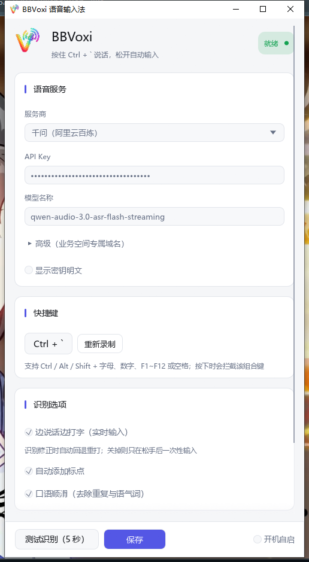

# 交互修复 + UI 改版报告

日期：2026-09-10 第四轮

---

## 一、按下说话 / 松开出字（根因 + 修复）

### 根因：松开快捷键的指令被代码吞掉了

```rust
// 修复前
cmd = rx.recv() => match cmd {
    Some(Cmd::Start) | None => break,
    Some(_) => {}          // ← Cmd::Stop 落进这里，什么也没做
},
```

钩子确实在松开时发出了 `Cmd::Stop`，但会话循环把这个分支当成了「无关指令」忽略掉，
于是录音会一直持续到 55 秒上限才收尾出字。**这就是"放开快捷键不出字"的全部原因**。

### 修复

```rust
cmd = rx.recv() => match cmd {
    Some(Cmd::Stop) | None => break,          // 松开 = 结束录音，立刻收尾
    Some(Cmd::Start) | Some(Cmd::Test) => {}  // 已在录音，重复启动忽略
},
```

顺带修掉一个会导致录音中途断掉的问题：连接建立较慢时音频缓冲会满，
原来「缓冲满」被当成「接收端已退出」而**直接停掉麦克风线程**，整场录音作废。
现在区分两种情况：缓冲满只丢帧并记一次日志，只有接收端真正关闭才收工；
缓冲也从 32 帧（3.2 秒）提到 100 帧（10 秒）。

### 现在的行为

| 操作 | 结果 |
|---|---|
| 按住快捷键 | 立刻开始录音（麦克风先起，音频先缓冲，再连服务端，不丢开头） |
| 松开快捷键 | 立即结束 → 收尾识别 → 文字直接打进光标位置 |
| 按多久 | **不限时长**（已按要求删除「单次录音上限」设置） |
| 测试识别 | 固定 5 秒自动结束，结果只显示在窗口里 |

---

## 二、UI 改版

### 设计思路

视觉基调直接从你选的应用图标里取：**靛蓝 (#5457E5) → 青绿**。整个界面只用这一个强调色，
其余保持中性灰阶，靠留白和层次而不是装饰来撑起"现代感"。

- **一套令牌**：颜色、圆角、间距集中定义，跟随系统深浅色自动切换（浅色/深色两套都做了对比度断言测试）
- **品牌栏**：应用图标 + BBVoxi + 当前快捷键说明 + 右侧状态胶囊（就绪 / 录音中 / 未配置 / 出错了）
- **卡片分区**：语音服务 / 快捷键 / 识别选项 / 最近识别，每张卡圆角、细边框、统一内边距
- **分区标题**：左侧一根强调色短竖条，不用装饰性编号（内容不是序列，编号会是假信息）
- **底部固定操作条**：保存按钮永远可见，不用滚到底找



### 文案调整

按"用户视角、动作即结果"的原则改了措辞：

| 原文案 | 新文案 |
|---|---|
| 测试麦克风与连接 | **测试识别（5 秒）**（并注明"结果只显示在这里，不会往其他程序打字"） |
| 显示录音悬浮条 | 已删除（悬浮条整体移除） |
| 单次录音上限 [滑块] | 已删除（按多久说多久） |
| 空状态 | "还没有识别记录。点下面「测试识别」说一句话试试。" |

---

## 三、验证

| 项目 | 结果 |
|---|---|
| 单元测试 | **40 passed / 0 failed**（新增：旧配置含已删字段仍可正常加载、深浅色对比度断言） |
| `cargo fmt --check` | 通过 |
| release 构建 | 通过，0 告警，单文件 8.0 MB |
| **界面截图自查** | 启动 `--settings` 后用 Win32 `FindWindowW` + `GetWindowRect` 精确截取窗口区域，逐轮修掉了「品牌栏被裁掉」「布局被嵌套面板顶偏」两个真实问题 |
| 冒烟日志 | `注册全局快捷键：Ctrl + ``，无崩溃 |

本轮用到的自查手段（以后可复用）：
Pillow 的 `ImageGrab` + `ctypes` 调 `user32.FindWindowW / GetWindowRect`，
不依赖被安全策略禁用的 `Add-Type`，能精确只截应用窗口，不牵扯桌面其他内容。

---

## 四、请你验证

1. **按住快捷键说一句话 → 松开**：文字应立刻出现在光标处（这是本轮核心修复）
2. 说一段长话（超过 1 分钟）：不应再被 55 秒截断
3. 打开设置窗（右键托盘「打开设置」或 `bbvoxi.exe --settings`）：看新版界面是否顺眼
4. 若松手后仍不出字，请发 `%APPDATA%\BBVoxi\logs\bbvoxi.log` —— 现在每一次「快捷键按下 / 松开 → 结束录音 → 识别完成」都有日志可对照
